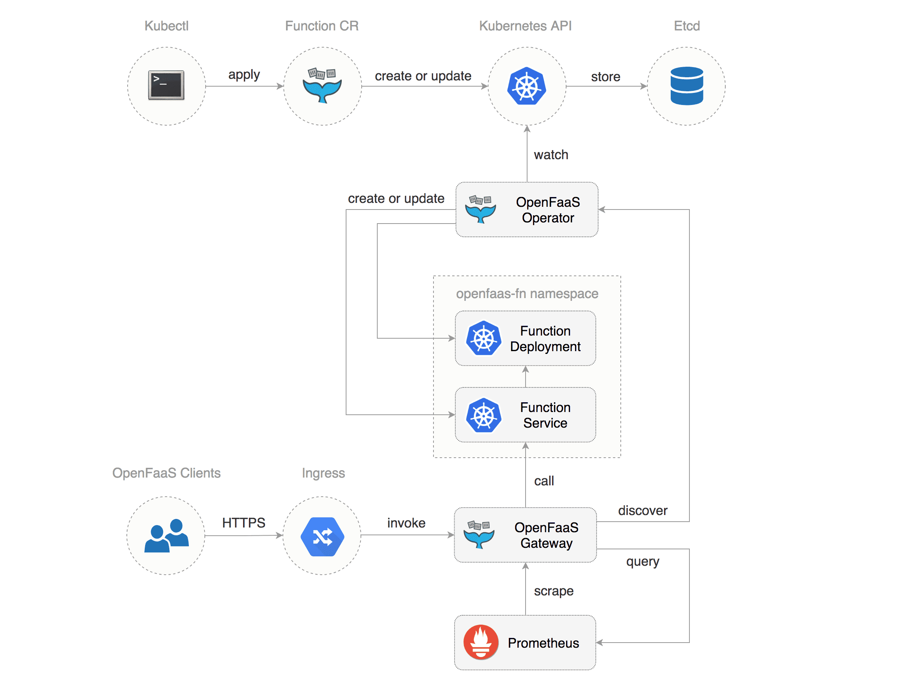

# OpenFaaS Operator - A Kubernetes CRD controller for Serverless

The OpenFaaS team released the Kubernetes operator for OpenFaaS.

This release brings me joy as I've been helping the OpenFaaS Team
with the design and development of the CRD controller.

<!-- more -->

The OpenFaaS Operator comes with an extension to the Kubernetes API that allows
users to manage OpenFaaS functions in a declarative manner.
The operator implements a control loop that tries to match the desired state
of OpenFaaS functions, defined as a collection of custom resources,
with the actual state of the Kubernetes cluster.

{ width="800" }

When installing OpenFaaS with the operator enabled, you can create functions
directly with `kubectl apply`.

Example of a function custom resource:

```yaml
apiVersion: openfaas.com/v1alpha2
kind: Function
metadata:
  name: certinfo
  namespace: openfaas-fn
spec:
  name: certinfo
  image: stefanprodan/certinfo:latest
  # translates to Kubernetes metadata.labels
  labels:
    # if you plan to use Kubernetes HPA v2 
    # delete the min/max labels and 
    # set the factor to 0 to disable auto-scaling based on req/sec
    com.openfaas.scale.min: "2"
    com.openfaas.scale.max: "12"
    com.openfaas.scale.factor: "4"
  # translates to Kubernetes container.env
  environment:
    output: "verbose"
    debug: "true"
  # translates to Kubernetes resources.limits
  limits:
    cpu: "1000m"
    memory: "128Mi"
  # translates to Kubernetes resources.requests
  requests:
    cpu: "10m"
    memory: "64Mi"
  # translates to Kubernetes nodeSelector
  constraints:
    - "beta.kubernetes.io/arch=amd64"
```

The OpenFaaS operator offers more options for managing functions on top of Kubernetes.
Besides the faas-cli and the OpenFaaS UI, you can now use Helm charts and [Flux](https://fluxcd.io)
to build continuous deployment pipelines in a GitOps way.

Find out more about Serverless with OpenFaaS on [openfaas.com](https://www.openfaas.com/).
